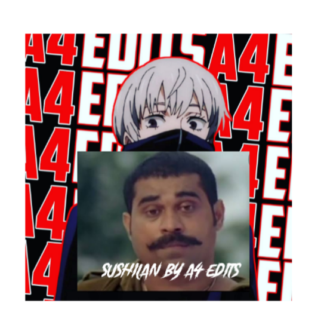

<a href="https://tinyurl.com/yjhned3h"></a>
<div align="center">

## [](https://git.io/typing-svg)
#### TOTAL REPO VIEWS📍


 </a>
</p>
<div align="center">
  <p align="center">

</p>
  <p align="center">
<a href="https://github.com/A4edits"></a>
</p>
</div>
<p align="center">
Project created by <a href="https://github.com/A4edits">sushilanv2</a> to make it public
    <br>
       | © |
        Reserved |
    <br> 
</p>
<div align="center">
 
- [x] Aco chatbot
- [x] sushilan v2
- [x] you can add bgm😌

<div align="center">
<details>
    <summary>⏬<b>CLICK HERE FOR MORE INFO⏬</b></summary>

## Setup
<div align="center"> 


## PASSWORD IS ⬇️⬇️

## afamk

  ### Simple Method
  
[](https://heroku.com/deploy?template=https://github.com/A4edits/sushilanv2.git)


  
[](https://replit.com/@sushilanv2/sushilanv2)
  
### The Hard Method
```js
GET QR
$ apt install git
$ apt install nodejs --fix-missing
$ git clone https://github.com/sushilanv2/sushilanv2
$ cd sushilanv2
$ npm install @adiwajshing/baileys
$ npm install chalk
$ node julie.js
```
      
```js
SETUP
$ git clone https://github.com/sushilanv2/sushilanv2
$ cd sushilanv2
$ npm i
$ node julie.js
```

----

  <p align="center">
  <a href="httsp://github.com/A4edits/sushilanv2">
    
<a href="https://github.com/A4edits/followers">

<p align="center">
<a href="https://github.com/A4edits/followers"
</a>
<a href="https://github.com/A4edits/sushilanv2/stargazers/"></a>
<a href="https://github.com/A4edits/sushilanv2/network/members"></a>
<a href="https://github.com/A4edits/sushilanv2/watchers"></a>
</p>
<p align="center">

<p>&nbsp;</p>

<p></p>

</p>

## 📢 Guide
Click WA logo to Join Support Group 👇
    <br>
<br>
  [](https://chat.whatsapp.com/JNqn5Ydt7vvJTmNv273BP3)
  <div align="center">
       
  [](https://github.com/A4edits/sushilanv2)
  </div>
    
### ⚠️ Warning! 
```
Due to Userbot; Your WhatsApp account may be banned.
This is an open source project, you are responsible for everything you do. 
Absolutely, Asena executives do not accept responsibility.
By establishing the Asena, you are deemed to have accepted these responsibilities.
 
By using kick, add, promote, demote Commands, Your WhatsApp account may be banned.

sushilanv2.0 or we are not responsible for your account, 

This bot is intended for the purpose of having fun with some fun commands 

and group management with some helpfull commands.

If  you ended up spamming groups, getting reported left and right, 

and you ended up in being fight with WhatsApp

and at the end WhatsApp Team deleted your account. DON'T BLAME US.

No personal support will be provided / We won't spoon feed you. 

If you need help

you can contact 👇🏻👇🏻 
```
**[](http://wa.me/919967413665?text=Can%20you%20help%20bro)**

## Developers
  <div align="center">
    
  [](https://github.com/farhan-dqz) | [](https://github.com/A4edits) |  [](https://github.com/AI-VIKI) | [](https://github.com/afnanplk) 
----|----|----|----
[farhan-dqz](https://github.com/farhan-dqz) | [A4edits](https://github.com/A4edits) | [TOXIC4L!3N](https://github.com/AI-VIKI) | [afnanplk](https://github.com/afnanplk) 
Developer, Base, Bug Fixes, Modules| Re-Developer, Bug Fixes, Modules, Commits |  Modifiying  as   public | Bug Fixes, Modules 
  </div>
    


## License
This project is protected by `GNU General Public Licence v3.0` license.

### Disclaimer
`WhatsApp` name, its variations and the logo are registered trademarks of Facebook. We have nothing to do with the registered trademark

<div align="center">
 
[](https://bit.ly/3lC8I7t)
